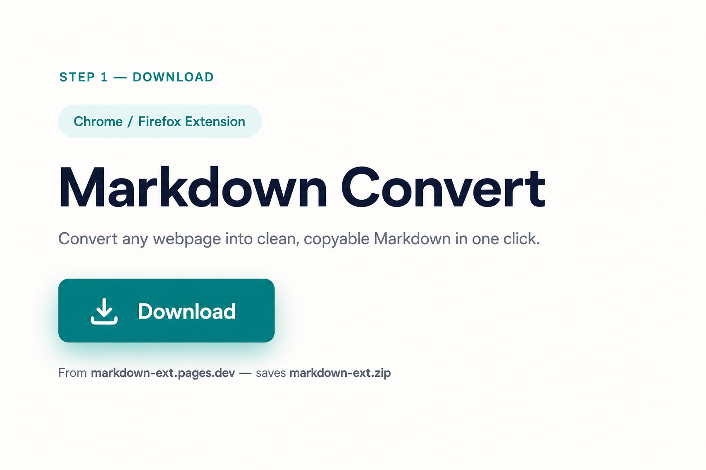
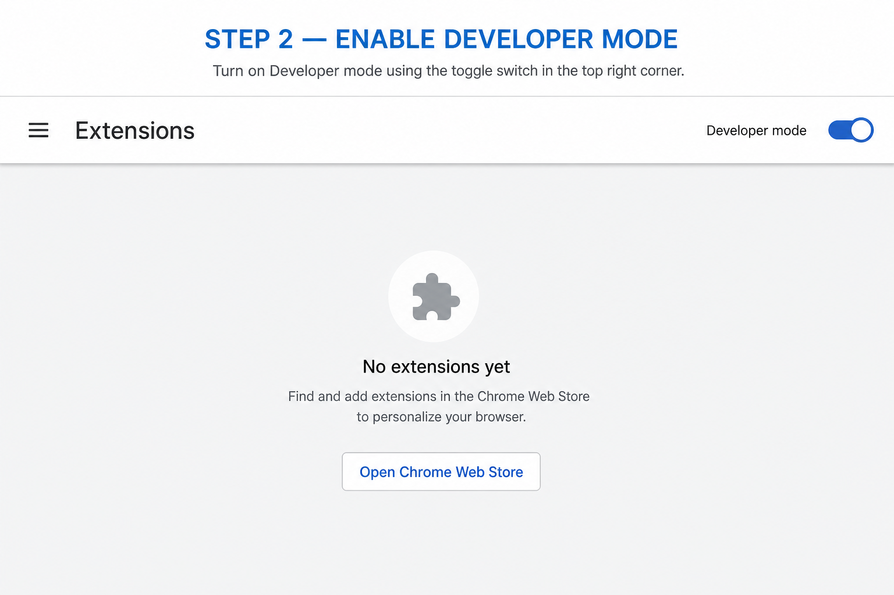
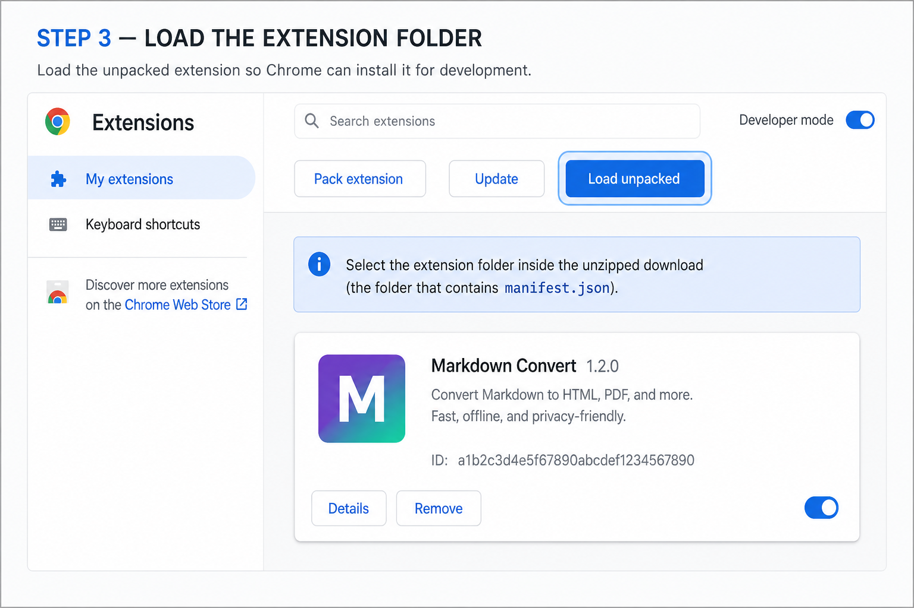
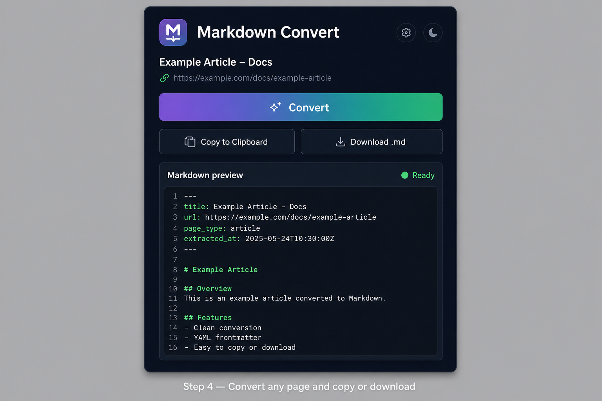

# Setup guide — Markdown Convert

Install the extension in Chrome or Firefox (Chromium) in a few minutes. You only need the **`extension`** folder from the download — not the whole repository.

## Requirements

- Google Chrome, Microsoft Edge, Brave, or another Chromium browser  
  (Firefox: same steps at `about:debugging` → *This Firefox* → *Load Temporary Add-on* → pick `manifest.json`)
- Developer mode enabled (one-time)

## Step 1 — Download the extension

1. Open **[markdown-ext.pages.dev](https://markdown-ext.pages.dev/)**
2. Click **Download**
3. Unzip `markdown-ext.zip` on your computer

You should see a folder named **`extension`** (it contains `manifest.json`).



## Step 2 — Enable Developer mode

1. Open **`chrome://extensions`** (paste into the address bar)
2. Turn on **Developer mode** (top-right toggle)



## Step 3 — Load the extension

1. Click **Load unpacked**
2. Select the **`extension`** folder from the unzipped download  
   (the folder that directly contains `manifest.json`, not the zip root)



**Tip:** On some Chrome versions you can drag the `extension` folder onto the Extensions page instead.

You should see **Markdown Convert** in the list, version **1.2.0** or newer.

## Step 4 — Convert a page

1. Visit any webpage (article, docs, blog post work best)
2. Click the **Markdown Convert** icon in the toolbar
3. Click **Convert**
4. Use **Copy to Clipboard** or **Download .md**



### Sample output

Agent-ready exports include YAML frontmatter:

```yaml
---
title: Page Title
url: https://example.com/page
page_type: article
extracted_at: 2026-05-29T12:00:00.000Z
---

## Your content here
```

## Troubleshooting

| Issue | What to try |
|-------|-------------|
| **Load unpacked is disabled** | Enable Developer mode first |
| **Extension won't load** | Select the inner `extension` folder (must contain `manifest.json`) |
| **No response from content script** | Refresh the tab, then convert again |
| **Output is very long / noisy** | Normal on marketing homepages; open a specific article URL instead |
| **"No readable content found"** | Page may be empty, login-only, or a pure app shell |

## Updating

1. Download a fresh zip from [markdown-ext.pages.dev](https://markdown-ext.pages.dev/)
2. At `chrome://extensions`, click **Reload** on Markdown Convert  
   — or remove and **Load unpacked** again

## Uninstall

Remove the extension from `chrome://extensions`, then delete the unzipped folder if you no longer need it.

---

Screenshots in this guide are illustrative UI mockups that match the current extension UI.

Questions or issues: [GitHub Issues](https://github.com/tanveerriaz/markdown-ext/issues)
