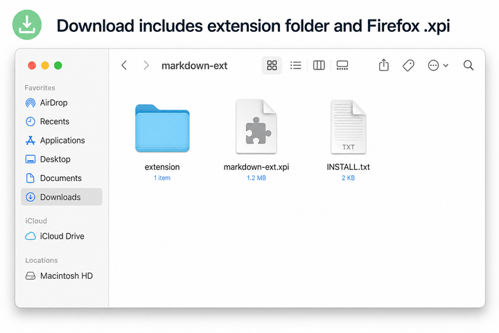
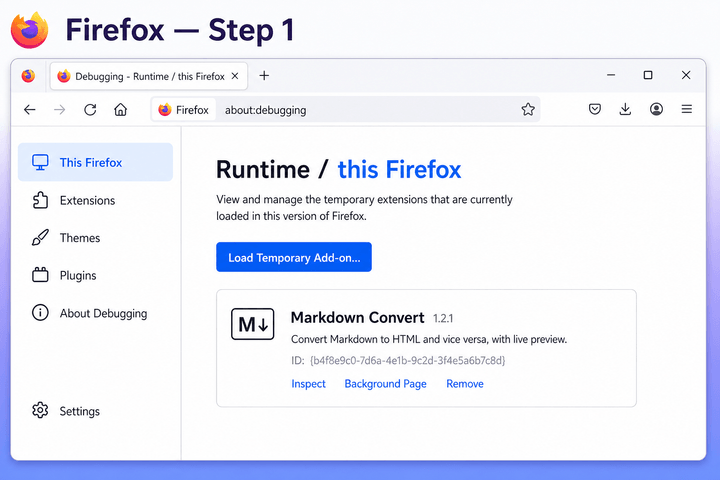
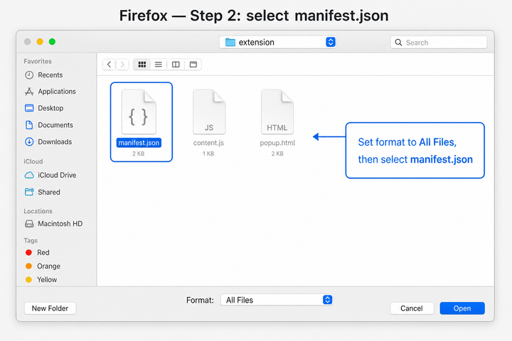

# Setup guide — Markdown Convert

Install the extension in **Chrome / Edge / Brave** or **Firefox** in a few minutes. Download from [markdown-ext.pages.dev](https://markdown-ext.pages.dev/) — you do not need to clone this repository.

## What’s in the download

After you unzip `markdown-ext.zip`, you get a **`markdown-ext`** folder with:

| Item | Use |
|------|-----|
| **`extension/`** | Chrome / Edge / Brave — Load unpacked |
| **`markdown-ext.xpi`** | Firefox — Load Temporary Add-on (optional one-file install) |
| **`INSTALL.txt`** | Quick reference |



---

## Chrome / Edge / Brave

### Requirements

- Chromium-based browser with **Developer mode** (one-time)

### Step 1 — Download

1. Open **[markdown-ext.pages.dev](https://markdown-ext.pages.dev/)**
2. Click **Download**
3. Unzip `markdown-ext.zip`


### Step 2 — Enable Developer mode

1. Open **`chrome://extensions`** (paste into the address bar)
2. Turn on **Developer mode** (top-right toggle)


### Step 3 — Load unpacked

1. Click **Load unpacked**
2. Select **`markdown-ext/extension`** (the folder that contains `manifest.json`)


**Tip:** On some Chrome versions you can drag the `extension` folder onto the Extensions page.

You should see **Markdown Convert** in the list, version **1.2.1** or newer.

### Step 4 — Convert a page

1. Visit any webpage (articles, docs, and blog posts work best)
2. Click the **Markdown Convert** toolbar icon
3. Click **Convert**
4. Use **Copy to Clipboard** or **Download .md**


---

## Firefox (macOS / Windows / Linux)

Firefox does not use “Load unpacked” the same way. Install a **temporary** add-on (removed when you fully quit Firefox).

### Step 1 — Download

Same as Chrome: download and unzip from [markdown-ext.pages.dev](https://markdown-ext.pages.dev/).

### Step 2 — Open debugging

1. In the address bar, open **`about:debugging`**
2. Click **This Firefox** in the left sidebar
3. Click **Load Temporary Add-on…**



### Step 3 — Select the extension

**Option A — manifest.json (recommended)**

1. In the file picker, set **Format** to **All Files** (not “Web Extensions” only)
2. Open **`markdown-ext/extension/`**
3. Select **`manifest.json`**



**Option B — XPI file**

1. In the same dialog, select **`markdown-ext.xpi`** from the unzipped folder (no need to open the `extension` subfolder)

If files look grayed out, switch the format dropdown to **All Files** — Firefox often filters to `.xpi` only by default.

### Step 4 — Convert a page

Same as Chrome: open a page, click the extension icon, then **Convert**.

**Note:** Temporary add-ons disappear after a **full** browser quit (not just closing a window). Reload from `about:debugging` when you update the extension.

---

## Sample output

Agent-ready exports include YAML frontmatter:

```yaml
---
title: Page Title
url: https://example.com/page
page_type: article
extracted_at: 2026-05-29T12:00:00.000Z
---

## Your content here
```

## Troubleshooting

| Issue | What to try |
|-------|-------------|
| **Load unpacked is disabled** (Chrome) | Enable Developer mode first |
| **Extension won't load** | Select `markdown-ext/extension` (must contain `manifest.json` and `readability.min.js`) |
| **Firefox: files grayed out** | Set file picker to **All Files**, then pick `manifest.json` or `markdown-ext.xpi` |
| **Firefox: add-on gone after restart** | Expected for temporary installs — load again from `about:debugging` |
| **No response from content script** | Refresh the tab, then convert again |
| **Output is very long / noisy** | Normal on marketing homepages; open a specific article URL instead |
| **YouTube channel shows only header, no videos** | Scroll the channel page to load videos, then convert again (v1.2.1+) |
| **"No readable content found"** | Page may be empty, login-only, or a pure app shell |

## Updating

1. Download a fresh zip from [markdown-ext.pages.dev](https://markdown-ext.pages.dev/)
2. **Chrome:** `chrome://extensions` → **Reload** on Markdown Convert (or remove and Load unpacked again)
3. **Firefox:** `about:debugging` → remove old entry → **Load Temporary Add-on** again

## Uninstall

- **Chrome:** Remove from `chrome://extensions`
- **Firefox:** Remove from `about:debugging`, or quit Firefox (temporary add-on)

Delete the unzipped folder if you no longer need it.

---

Screenshots in this guide are illustrative UI mockups that match the current extension UI.

Questions or issues: [GitHub Issues](https://github.com/tanveerriaz/markdown-ext/issues)
